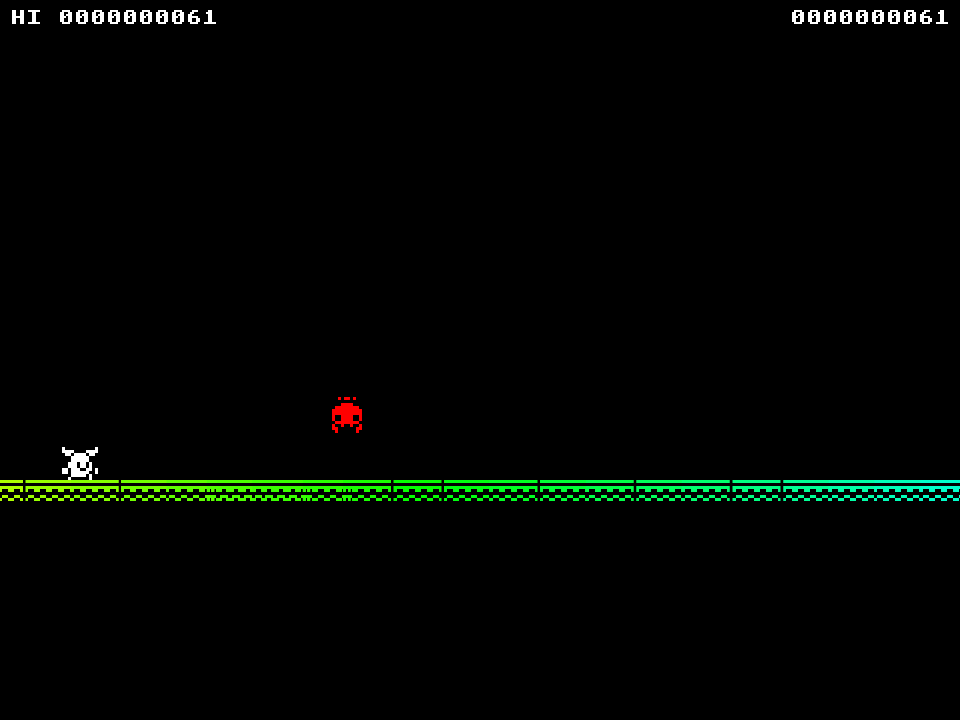

# Rainbow Runner

Rainbow Runner is a JavaScript game, made using [Kaboom.js](https://kaboomjs.com/) made for the [One Game a Month](https://itch.io/jam/one-game-a-month-3) Game Jam of August 2021. Rainbow Runner is an endless runner arcade game, inspired by Google Chrome's dino runner game.

The game is available to play, for free, in your browser at: https://swilliamsio.itch.io/rainbow-runner

All programming was written by [s-williams](https://github.com/s-williams). Graphics and sound effects were provided by [Kenney](https://www.kenney.nl/) (CC0). Music was provided by [WaxTerK](https://www.newgrounds.com/audio/listen/1056740) (CCBY-SA).
